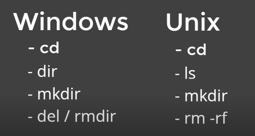

# Introdução ao Git e Github

## Entendendo o que é Git e sua importância

Ferramenta que lhe permite o versionamento e sistema distribuído do seu código, veja as vantagens:

- Controle de versão
- Armazenamento em nuvem
- Trabalho em equipe
- Melhorar seu código
- Reconhecimento

## Comandos básicos para um bom desempenho no terminal



## Realizando a instalação do GIT

Acesse o site [https://git-scm.com/](https://git-scm.com/)

Realize a instalação conforme o seu sistema operacional.

Durante a instalação, temos uma novidade, o termo master foi substituído por main!

Veja abaixo os motivos:

https://gizmodo.uol.com.br/github-planeja-remover-termos-como-master/)

Durante a instalação, pode deixar o Git decidir sobre o nome da branch inicial:


Selecionar Git Credential Manager Core:


# Primeiros comandos com GIT

## iniciando o GIT e criando um commit

- Iniciar o GIT
- Iniciar o versionamento
- Criar um commit.

Comandos

- git init
- git add
- git commit

### Criando um repositório

Recomendo criar alguma pasta chamada workspace, clicar com o botão direito dentro dela e selecionar GIT BASH HERE

Criar uma pasta chamada livro-receitas dentro da pasta workspace

```bash
mkdir livro-receitas
```

Iniciar o git:

```bash
git init
```

Ele cria uma pasta oculta na raiz do projeto chamada .git

Para mostrar arquivos ocultos:

```bash
ls -a
```

Configurar os dados de email e nome:

```bash
git config --global user.email "seuemail"
git config -- user "Seu nome"
```

### Adicionando um arquivo

Vamos utilizar o Markdown, extensão .md


Criar um arquivo [strogonoff.md](http://strogonoff.md) dentro da raiz do projeto


Salve o arquivo.

No git bash, vamos preparar o arquivo para commit:

```bash
git add *
```

Realizar o commit

```bash
git commit -m "Descrição do commit"
```


# Trabalhando com o Github

### Adicionando o repositório remoto

```bash
git remote add origin remoteadress.git
```

Para visualizar os repositórios remotos:

```bash
git remote -v
```

### Enviando as informações locais para o repositório remoto

```bash
git push origin master
```

## Como os conflitos acontecem no GitHub e como resolvê-los

Antes de realizar um push para o github, precisamos ter certeza que estamos trabalhando no arquivo mais atual possível, por isso, é necessário realizar o comando pull para resolver essa situação.

```bash
git pull origin master
```

Realize as modificações necessárias e pronto, pode efetuar um push novamente para o servidor remoto.